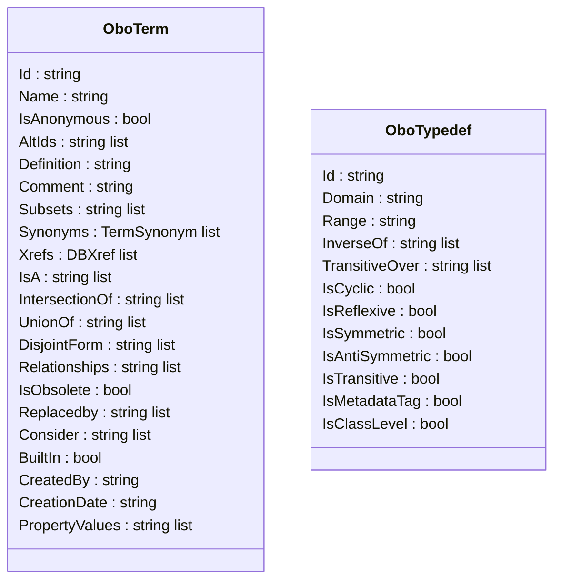
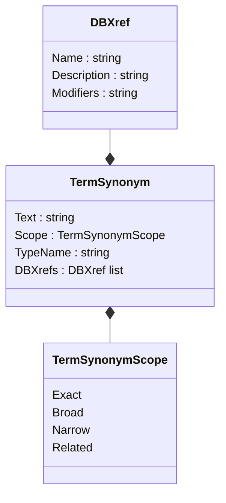
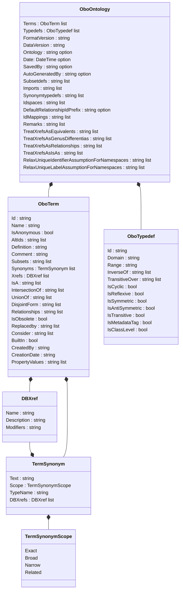

# OBO

We realize the OBO flat file format model via the classes `OboTerm`, `OboTypedef`, and `OboOntology` where `OboTerm` and `OboTypedef` correspond to the `[Term]` and `[Typedef]` stanzas, respectively.  



Xrefs are defined as `DBXref` in the standard which we model with the epinymous class. Synonyms are modelled via `TermSynonym`s where each `TermSynonym` has its own `TermSynonymScope`. This better depicts the way synonyms are defined in the standard.



An `OboOntology` consists of headers on the one hand, and `OboTerm`s and `OboTypedef`s on the other.



## Getting started

#### Read an OBO file:

```fsharp
open Ontology.NET.OBO


let testOntology = OboOntology.fromFile true filepath
```

#### Create OBO terms:

OOP style (recommended):

```fsharp
let myOboTerm = 
	OboTerm.Create(
		"TO:00000000", 
		Name = "testTerm", 
		CreatedBy = "myself"
	)
```

Functional style:

```fsharp
let myOboTerm = 
	OboTerm.create 
		"TO:00000000" 
		(Some "testTerm") 
		None 
		None 
		None 
		None 
		None 
		None 
		None 
		None 
		None 
		None 
		None 
		None 
		None 
		None 
		None 
		None 
		None 
		(Some "myself") 
		None
```

#### Create an OBO ontology:

```fsharp
let myOntology = OboOntology.create [myOboTerm] []
```

#### Save an OBO ontology:

```fsharp
OboOntology.toFile "myOboOntology.obo" myOntology
```

## Working with an OboOntology

#### Get all `is_a`s of a Term:

```fsharp
let termOfInterest = testOntology.Terms[5]

let isAs = OboOntology.getIsAs termOfInterest testOntology
// output is a list of (input OboTerm * is_a OboTerm (if it exists in the given OboOntology))
```

#### Get all `is_a`s of a Term recursively:

```fsharp
let termOfInterest = testOntology.Terms[5]

let isAs = testOntology.GetParentOntologyAnnotations(termOfInterest.Id)
// output is an ISADotNet.OntologyAnnotation list

let isAsTerms = isAs |> List.map (fun oa -> testOntology.GetTerm(oa.TermAccessionString.ToString()))
// output is an OboTerm list
```

#### Get all related Terms of a Term:

```fsharp
let termOfInterest = testOntology.Terms[5]

let relatedTerms = OboOntology.getRelatedTerms termOfInterest testOntology
// output is a list of (input OboTerm * relation as string * related OboTerm (if it exists in the given OboOntology))
```

#### Get all synonym Terms of a Term:

```fsharp
let termOfInterest = testOntology.Terms[5]

let synonyms = OboOntology.tryGetSynonyms termOfInterest testOntology
// output is a seq of (TermSynonymScope * synonymous OboTerm (if it exists in the given OboOntology))
```

### Working with TermRelations:

TermRelations are abstractions of all relations that an OboTerm can have with another one. Such TermRelations can be
- `Empty of SourceTerm` (if there is no TermRelation between a SourceTerm and a TargetTerm),
- `TargetMissing of Relation * SourceTerm` (if there is a TermRelation between a SourceTerm and a TargetTerm but the TargetTerm is missing), 
- and `Target of Relation * SourceTerm * TargetTerm`.
Relation is of generic type `'a` and can therefore be of any type that you prefer (e.g. `string` or a custom-made Record or Union).

### Create a TermRelation:

```fsharp
let termOfInterest = testOntology.Terms[5]
let targetOfInterest = testOntology.Terms[7]

let emptyTermRelation = Empty termOfInterest
let targetMissingTermRelation = TargetMissing ("unconnected_to", termOfInterest)
let targetTermRelation = Target ("connected_to", termOfInterest, targetOfInterest)

// exemplary
type MyRelation =
	| IsA
	| HasA
	| PartOf
	| ConnectedTo
	| Unknown of string

let targetTermRelation' = Target (ConnectedTo, termOfInterest, targetOfInterest)
```

#### Get all TermRelations of a Term:

```fsharp
let termOfInterest = testOntology.Terms[5]

let relations = OboOntology.getRelations termOfInterest testOntology
// output is a list of TermRelations<string> (includes all relationships and is_as)
```