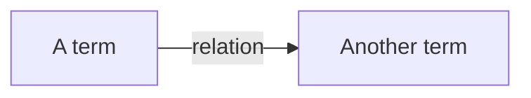
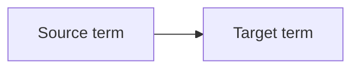
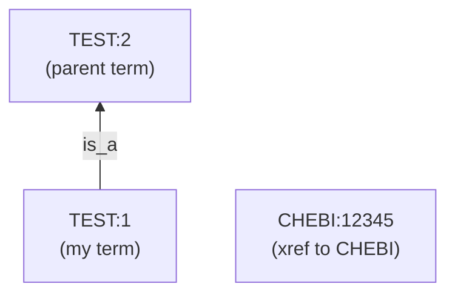
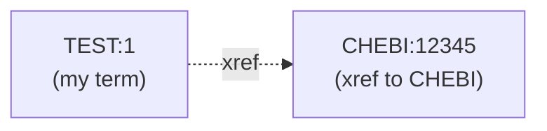

# Ontology

An `Ontology` in **Ontology.NET** represents a directed graph of ontology terms and their semantic relationships. Each node is a `CvTerm`, and each edge is a `RelationType` (e.g. `is_a`, `xref`, or custom).



- A **source** term is the origin of a relation (the node the edge starts from).
- A **target** term is the destination of a relation (the node the edge points to).



This allows modeling real-world ontologies in a graph structure where terms are connected through typed relations.

### Example

Let's assume that `"TEST:1"` is a subclass of `"TEST:2"` and that it has a cross-reference to `"CHEBI:12345"`.  
(Cross-references (Xrefs) are often used to depict synonymous terms across different ontologies)





## Getting started

Parse an `Ontology` from an `OboOntology` using the respective function:

```fsharp
open Ontology.NET
open Ontology.NET.OBO


let path = @"C:\myOboFile.obo"

let oboOntology = OboOntology.fromFile false path

let ontology = Ontology.fromOboOntology oboOntology
```

Parse several ontologies from one `OboOntology` via (down)loading all ontologies from the import section of the header:

```fsharp
let ontologies = Ontology.fromOboOntologyWithImportsFromHeaders oboOntology
```

It's also possible to do this transitively (note that when parsing via relative paths, the base path must stay the same):

```fsharp
let ontologies = Ontology.fromOboOntologyWithImportsFromHeadersTransitively oboOntology
```

## Working with an Ontology

Once you have parsed your Ontology, you can access and manipulate its terms and relations.

#### Add a term:

```fsharp
open ControlledVocabulary


let newTerm = CvTerm.create("TEST:1", "test term 1", "TEST")

Ontology.addTerm newTerm ontology
```

#### Get all terms:

```fsharp
let allTerms = Ontology.getTerms ontology
```

#### Get a specific term:

```fsharp
let term = Ontology.getTerm "TEST:1" ontology
```

#### Try to get a term:

```fsharp
match Ontology.tryGetTerm "TEST:1" ontology with
| Some term -> printfn "Found: %s" term.Name
| None -> printfn "Not found."
```

#### Update a term:

```fsharp
let updatedTerm = CvTerm.create("TEST:1", "new name", "TEST")

Ontology.updateTerm "TEST:1" updatedTerm ontology
```

#### Remove a term:

```fsharp
let termX = CvTerm.create("TEST:X", "test term X", "TEST")
Ontology.addTerm termX ontology

Ontology.removeTerm "TEST:X" ontology
```

#### Add a relation:

```fsharp
open RelationTypes


Ontology.addTerm (CvTerm.create("TEST:2", "test term 2", "TEST")) ontology

Ontology.addRelation "TEST:1" "TEST:2" IsA ontology
```

#### Get relations between two terms:

```fsharp
let relations = Ontology.getRelation "TEST:1" "TEST:2" ontology
```

#### Remove a specific relation:

```fsharp
Ontology.removeRelation "TEST:1" "TEST:2" IsA ontology |> ignore
```

#### Remove all relations between two terms:

```fsharp
Ontology.removeRelations "TEST:1" "TEST:2" ontology |> ignore
```

## Traversing an Ontology

You can traverse an `Ontology` using the provided functions to search for specific term IDs, terms that match certain criteria, or relations between terms.

#### Get direct superclasses (is_a targets):

```fsharp
let superClasses = Ontology.getSuperClassesTransitively "TEST:1" ontology
```

#### Get direct subclasses (is_a sources):

```fsharp
let subClasses = Ontology.getSubClassesTransitively "TEST:1" ontology
```

#### Get superclasses with depth limit:

```fsharp
let limitedSuperClasses = Ontology.getSuperClassesWithDepthTransitively "TEST:1" 2 ontology
```

#### Get subclasses including xrefs:

```fsharp
let subclassesWithXrefs = Ontology.getSubClassesWithXrefsTransitively "TEST:1" ontology
```

#### Traverse target-related terms with a custom predicate:

```fsharp
let result = Ontology.getTargetTermsBy "TEST:1" (fun termId term rels -> Set.contains Xref rels) ontology
```

#### Traverse source-related terms up to a certain depth:

```fsharp
let result = Ontology.getSourceTermsWithDepth "TEST:1" 3 ontology
```

#### Combine depth and predicate traversal (e.g. only follow is_a):

```fsharp
let result = Ontology.getTargetTermsWithDepthBy "TEST:1" 5 (fun _ _ rels -> Set.contains IsA rels) ontology
```

#### Traverse including xrefs (depth + predicate):

```fsharp
let result = Ontology.getSourceTermsWithXrefsWithDepthBy "TEST:1" 4 (fun _ _ rels -> Set.contains IsA rels) ontology
```